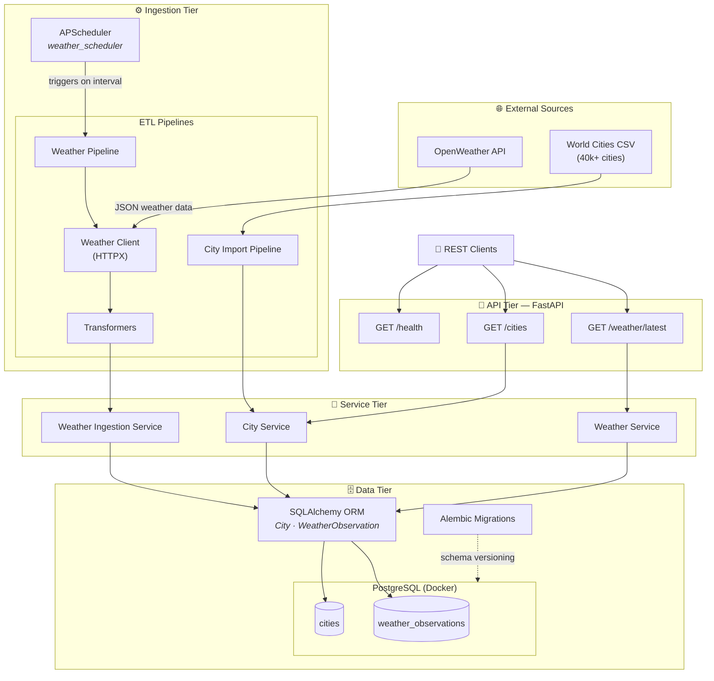

# 🌦️ CityPulse

A production-style weather data ingestion platform built with FastAPI, PostgreSQL, SQLAlchemy, and Docker.

CityPulse periodically ingests weather data from the OpenWeather API, stores historical observations, and exposes REST APIs for querying cities and weather information.

## 🏗️ Architecture



## ✨ Features

- Import over 40,000 cities from a CSV dataset.
- Fetch real-time weather data using the OpenWeather API.
- Store historical weather observations.
- Automatic scheduled ingestion using APScheduler.
- RESTful APIs built with FastAPI.
- PostgreSQL database managed with SQLAlchemy ORM.
- Alembic database migrations.
- Dockerized development environment.
- Structured logging for ingestion jobs.

## 🛠️ Tech Stack

| Category | Technology |
|----------|------------|
| Language | Python 3.10 |
| API | FastAPI |
| ORM | SQLAlchemy |
| Validation | Pydantic |
| Database | PostgreSQL |
| Migrations | Alembic |
| Scheduler | APScheduler |
| Containerization | Docker & Docker Compose |
| HTTP Client | HTTPX |
| Weather Provider | OpenWeather API |

## 📁 Project Structure

```text
app/
├── api/
├── clients/
├── core/
├── database/
├── etl/
├── models/
├── scheduler/
├── schemas/
├── services/
└── main.py
```

## 🔄 ETL Workflow

```text
Extract
    │
    ▼
OpenWeather API
    │
    ▼
Weather Client
    │
    ▼
Transformer
    │
    ▼
WeatherObservation Model
    │
    ▼
SQLAlchemy Session
    │
    ▼
PostgreSQL
```

## 📡 API Endpoints

| Method | Endpoint | Description |
|---------|----------|-------------|
| GET | `/health` | Health check |
| GET | `/cities` | List all cities |
| GET | `/weather/latest` | Retrieve the latest weather observations |

## 🚀 Running the Project

```bash
git clone https://github.com/n1mn/citypulse-ingestion.git

cd citypulse-ingestion

uv sync

docker compose up -d

uv run alembic upgrade head

uv run uvicorn app.main:app --reload
```

## 🚀 Future Improvements

- Redis caching
- Kafka-based ingestion pipeline
- Multiple weather providers
- Authentication & Authorization
- Metrics with Prometheus
- Grafana dashboards
- Kubernetes deployment

## 📚 Concepts Demonstrated

- REST API Design
- Layered Architecture
- ETL Pipelines
- Service Layer Pattern
- SQLAlchemy ORM
- Database Relationships
- Transactions
- Batch Processing
- Background Scheduling
- Environment-based Configuration
- Dockerized Development
- Structured Logging

## 📌 Project Status

✅ Version: **v1.0**

This project demonstrates a production-style backend architecture for weather data ingestion using FastAPI, PostgreSQL, SQLAlchemy, Docker, and APScheduler.

Future versions will introduce Kafka, Redis, distributed processing, and cloud deployment.

## 👨‍💻 Author

**Naman Sharma**

Built as part of a Data Engineering portfolio focused on production-grade backend systems and modern data platforms.